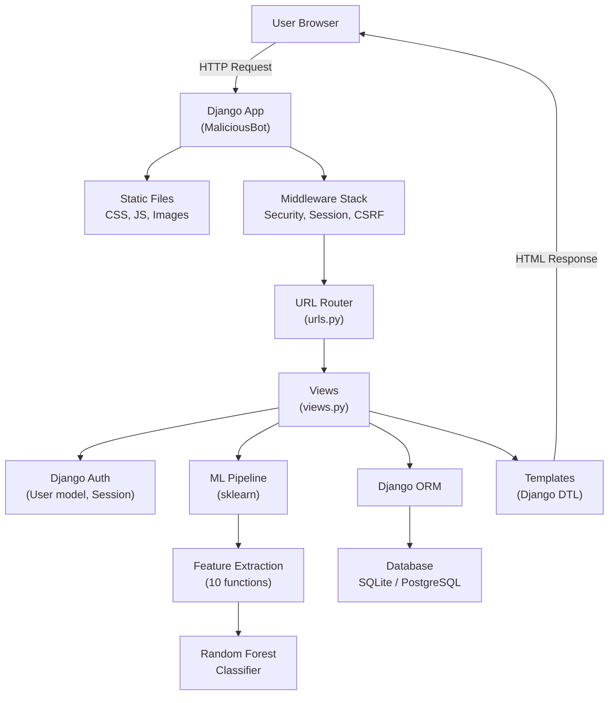
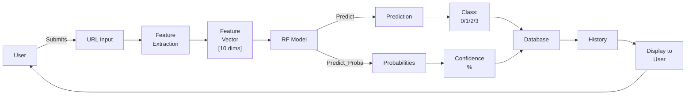

# Complete Codebase Analysis: MaliciousBot URL Detection System

## 1. Executive Summary

**MaliciousBot** is a Django-based machine learning application for classifying URLs into four categories: Benign, Defacement, Phishing, and Malware. The system uses a Random Forest classifier trained on static CSV datasets containing 400 labeled URLs (100 per category). Users register, log in, submit URLs for analysis, and receive predictions with confidence scores. An admin dashboard allows superusers to view all prediction records. The application deploys to Render.com and supports both SQLite (local) and PostgreSQL (production via dj_database_url). ML dependencies are optional for development; predictions fail gracefully when unavailable.

---

## 2. Repository Structure

```
diploma-project/
├── MaliciousBot/              # Django project configuration
│   ├── __init__.py
│   ├── settings.py            # Django settings, DB config, app registry
│   ├── urls.py                # Main URL routing
│   ├── wsgi.py                # WSGI application entry point
│   └── asgi.py                # ASGI application entry point
├── User/                      # Django app for URL prediction logic
│   ├── models.py              # MaliciousBot model (prediction records)
│   ├── views.py               # All business logic: auth, prediction, ML
│   ├── urls.py                # App URL routing
│   ├── admin.py               # Django admin (currently empty)
│   ├── apps.py                # App configuration
│   ├── tests.py               # Empty test file
│   └── migrations/            # Database schema evolution
│       ├── 0001_initial.py    # Create MaliciousBot model
│       ├── 0002_alter_maliciousbot_id.py  # BigAutoField
│       └── 0003_alter_maliciousbot_options_maliciousbot_confidence_and_more.py
├── templates/                 # Django HTML templates
│   ├── nav.html               # Base template with navigation
│   ├── index.html             # Homepage with carousel
│   ├── register.html          # User registration form
│   ├── login.html             # User login form
│   ├── adminlogin.html        # Admin login form
│   ├── predict.html           # URL prediction form & results display
│   ├── data.html              # Prediction history table
│   ├── adminhome.html         # Admin dashboard (prediction records table)
│   └── contact.html           # (listed but not inspected; likely unused)
├── static/                    # Static assets
│   ├── dataset/
│   │   ├── Phishing.csv       # 400 labeled URLs (100 per class)
│   │   └── malicious_phish.csv # Duplicate/backup of Phishing.csv
│   ├── css/
│   ├── js/
│   └── images/
├── manage.py                  # Django CLI management script
├── requirements.txt           # Python dependencies (26 packages)
├── render.yaml                # Render.com deployment config
├── README.md                  # Project documentation
├── .gitignore                 # Git ignore patterns
└── db.sqlite3                 # SQLite database (local development)
```

### Role of Each Major Directory

- **MaliciousBot/**: Django project configuration layer. Defines settings, middleware, URL routing, WSGI/ASGI entry points, and database configuration. Supports both SQLite and PostgreSQL via environment variables.
- **User/**: Single Django app containing all application logic: user authentication, URL prediction pipeline, ML model training/inference, feature extraction, and database models.
- **templates/**: Django template files rendering HTML pages. Uses Django template language (DTL) for dynamic content, CSRF tokens, and conditional rendering based on user authentication.
- **static/**: Public assets including training/testing datasets (CSV), CSS, JavaScript, and images. Datasets are baked into the repository and loaded at model training time.

---

## 3. Complete File Inventory

| File Path | Type | Responsibility | Key Content |
|-----------|------|-----------------|-------------|
| `manage.py` | Python Script | Django CLI entry point | Loads settings, executes management commands |
| `MaliciousBot/settings.py` | Config | Django application settings | Database (SQLite/PostgreSQL), apps, middleware, security, static files, environment loading |
| `MaliciousBot/urls.py` | Config | URL routing (project-level) | Routes `/admin/` to Django admin, `/` to User app |
| `MaliciousBot/wsgi.py` | Config | WSGI application | Entry point for production web servers (gunicorn) |
| `MaliciousBot/asgi.py` | Config | ASGI application | Entry point for async servers (unused in current deployment) |
| `User/models.py` | Model | Database schema | MaliciousBot model: stores URL, prediction, confidence, user, timestamp |
| `User/views.py` | View | Business logic (909 lines) | Authentication, URL prediction pipeline, ML training, feature extraction, DB writes |
| `User/urls.py` | Config | URL routing (app-level) | 10 endpoints: index, register, login, predict, data, logout, adminhome, adminlogin, health, status |
| `User/admin.py` | Config | Django admin registration | Empty (MaliciousBot model not registered in admin) |
| `User/apps.py` | Config | App configuration | App name: User |
| `User/tests.py` | Test | Unit tests | Empty (no tests implemented) |
| `User/migrations/0001_initial.py` | Migration | Initial schema | Creates MaliciousBot(id, url, bot) |
| `User/migrations/0002_alter_maliciousbot_id.py` | Migration | ID type change | Alters id field to BigAutoField |
| `User/migrations/0003_...confidence_and_more.py` | Migration | Schema expansion | Adds user FK, prediction, prediction_type, confidence, timestamp; orders by -timestamp |
| `templates/nav.html` | Template | Base layout & navigation | Header, navbar, conditional auth display, Django blocks for content |
| `templates/index.html` | Template | Homepage | Carousel, about section, services, testimonials, contact form |
| `templates/register.html` | Template | User registration | Form: username, email, password, confirm password |
| `templates/login.html` | Template | User login | Form: username, password |
| `templates/adminlogin.html` | Template | Admin login | Form: username, password (checks is_superuser) |
| `templates/predict.html` | Template | URL prediction interface | Form textarea for URL input, displays prediction result and type |
| `templates/data.html` | Template | Prediction history | Table of user's past predictions: URL, type, confidence, timestamp |
| `templates/adminhome.html` | Template | Admin dashboard | Table of all predictions (superuser only): ID, URL, bot field |
| `static/dataset/Phishing.csv` | Data | Training/test data | 400 rows: columns [url, type]; 100 per class (benign, defacement, phishing, malware) |
| `static/dataset/malicious_phish.csv` | Data | Backup dataset | Duplicate of Phishing.csv (same 400 rows, 100 per class) |
| `requirements.txt` | Config | Dependencies | 26 Python packages (Django, scikit-learn, pandas, numpy, xgboost, tld, psycopg2, etc.) |
| `render.yaml` | Config | Deployment | Render.com config: Python 3.11.9, gunicorn start, build steps, env vars, PostgreSQL DB |
| `README.md` | Doc | Project overview | High-level explanation of project goals, tech stack, how it works, team |
| `.gitignore` | Config | Git exclusions | Excludes __pycache__, .env, *.sqlite3, *.h5, *.pkl, .ipynb, migrations (commented) |

---

## 4. File-by-File Explanation

### Core Django Configuration

**MaliciousBot/settings.py (159 lines)**
- Loads environment variables from `.env` file via custom `load_env_file()` function
- Secret key from `SECRET_KEY` env var (fallback: 'change-me-in-env')
- Debug mode controlled by `DEBUG` env var (default True)
- Allowed hosts and CSRF trusted origins from env (default localhost, 127.0.0.1)
- Installed apps: django built-ins + 'User' app
- Middleware stack: SecurityMiddleware, WhiteNoiseMiddleware (static file compression), session, CSRF, auth, messages, clickjacking
- Database: Default to SQLite (`db.sqlite3`), but if `DATABASE_URL` env var present and valid, uses `dj_database_url.parse()` to load PostgreSQL/other DB
- Static files: WhiteNoise compression, staticfiles directory configured
- Template engine: Django templates, dirs point to `templates/` folder
- WSGI application: `MaliciousBot.wsgi:application`

**MaliciousBot/urls.py (22 lines)**
- Main URL configuration
- Routes: `/admin/` → Django admin, `/` → includes `User.urls`

**MaliciousBot/wsgi.py (16 lines)**
- WSGI application factory for gunicorn (production)

**MaliciousBot/asgi.py (16 lines)**
- ASGI application factory (async; not used in current deployment)

---

### Application Logic & ML

**User/models.py (18 lines)**
- Single model: `MaliciousBot`
- Fields:
  - `id`: BigAutoField (primary key)
  - `user`: ForeignKey to django.contrib.auth.User (nullable, cascade delete)
  - `url`: TextField (required)
  - `bot`: CharField max 90 (nullable, unused)
  - `prediction`: TextField (stores full prediction text, nullable)
  - `prediction_type`: CharField max 50 (stores class: Benign/Defacement/Phishing/Malware, nullable)
  - `confidence`: CharField max 50 (stores percentage string, nullable)
  - `timestamp`: DateTimeField auto_now_add (auto-set on creation)
- Meta: ordered by `-timestamp` (newest first)
- `__str__`: returns formatted string with user, URL, and type

**User/views.py (909 lines) — CORE APPLICATION LOGIC**

This file contains the entire application: authentication, ML pipeline, feature extraction, prediction, and DB operations. Below is a function-by-function breakdown:

**Helper Functions:**

1. **hash_encode(category)** — Converts string to 8-digit integer hash using MD5 (used for encoding region/domain names)

2. **extract_root_domain(url)** — Extracts domain from URL using tldextract library (or fallback manual parsing); returns domain name part

3. **get_url_length(url)** — Removes protocol (http/https) and www, returns character count

4. **count_letters(url)** — Counts alphabetic characters

5. **count_digits(url)** — Counts numeric characters

6. **count_special_chars(url)** — Counts punctuation characters

7. **has_shortening_service(url)** — Regex pattern matching against 40+ URL shortening services (bit.ly, tinyurl, ow.ly, etc.); returns 1 if match, 0 if not

8. **abnormal_url(url)** — Parses URL, extracts hostname, searches if hostname appears in full URL; returns 1 (abnormal) if found, 0 (normal) if not. Logic is inverted: legitimate URLs typically have the hostname in the URL.

9. **secure_http(url)** — Returns 1 if scheme is 'https', 0 otherwise

10. **have_ip_address(url)** — Complex regex detecting IPv4 (decimal and hex), IPv6, and IP:port patterns; returns 1 if IP found, 0 otherwise

11. **get_url_region(primary_domain)** — 180+ country TLD mappings (.com → Global, .ru → Russia, .uk → United Kingdom, etc.); returns region string

**Model Training:**

**train_model()** — (Lines 214-310)
- Global variables: `pipeline`, `model_trained`
- Returns False if ML not available
- Returns True if already trained (caching)
- Loads `static/dataset/Phishing.csv` via pandas
- Encodes labels: benign→0, defacement→1, phishing→2, malware→3
- **Feature Engineering Pipeline** on all 400 URLs:
  - `url_len`: extracted via `get_url_length()`
  - `letters_count`: via `count_letters()`
  - `digits_count`: via `count_digits()`
  - `special_chars_count`: via `count_special_chars()`
  - `shortened`: 1/0 via `has_shortening_service()`
  - `abnormal_url`: 1/0 via `abnormal_url()`
  - `secure_http`: 1/0 via `secure_http()`
  - `have_ip`: 1/0 via `have_ip_address()`
  - `pri_domain`: root domain via `extract_root_domain()`
  - `url_region`: hashed region via `get_url_region()`
  - `root_domain`: hashed domain via `hash_encode()`
- Fills NaN with 0
- Drops columns: url_type, url, pri_domain, type (keeps 10 numeric features)
- Cleans labels (coerce to numeric, drop NaN)
- **Memory optimization**: Caps training to 10k samples max
- 70-30 train/test split (random_state=42)
- **Primary model**: RandomForestClassifier with 50 trees, max_depth=15, min_samples_split=10, min_samples_leaf=5
- If RF fails, **fallback**: LogisticRegression (lbfgs solver, max_iter=1000)
- Both wrapped in sklearn Pipeline
- Prints training data shape and target distribution

**View Functions (Routes):**

1. **index(request)** — Renders homepage (index.html)

2. **register(request)** — POST: creates new user
   - Validates: all fields present, passwords match, email unique, username unique
   - Creates User object via `User.objects.create_user()`
   - Redirects to /login on success
   - Returns form on GET

3. **login(request)** — POST: authenticates user
   - Validates: username and password present
   - Calls `auth.authenticate()` and `auth.login()` (Django session management)
   - Redirects to /predict on success
   - Returns form on GET

4. **adminlogin(request)** — POST: authenticates admin
   - Same as login but additionally checks `user.is_superuser`
   - Redirects to /adminhome on success
   - Returns form on GET

5. **adminhome(request)** — GET: admin dashboard
   - Checks if user is superuser
   - Fetches all `MaliciousBot` records via `MaliciousBot.objects.all()`
   - Renders adminhome.html with data
   - Redirects to adminlogin if not superuser

6. **predict(request)** — POST: URL classification
   - Validates: URL not empty, user authenticated
   - **Lazy ML training**: if `model_trained` False and ML available, calls `train_model()` on first prediction (can take 10+ seconds)
   - **If ML not available**: Returns mock prediction ("Mock prediction: URL appears safe")
   - **Feature extraction**: Calls all 10 feature functions on input URL
   - **Prediction**: Calls `pipeline.predict(features)` → returns class [0,1,2,3]
   - **Confidence**: Calls `pipeline.predict_proba(features)` → returns probabilities, takes max × 100
   - **Type mapping**: 0→Benign, 1→Defacement, 2→Phishing, 3→Malware
   - **Database save**: Creates `MaliciousBot` record with url, prediction, prediction_type, confidence, user, timestamp
   - Renders predict.html with result
   - Extensive error handling with try/except and traceback printing

7. **data(request)** — GET: prediction history
   - Checks authentication (redirects to login if not)
   - Fetches user's `MaliciousBot` records filtered by user, ordered by -timestamp
   - Formats timestamp to 'YYYY-MM-DD HH:MM:SS'
   - If ML not available, returns mock data
   - Renders data.html with list of dicts

8. **logout(request)** — GET: logout
   - Calls `auth.logout(request)`
   - Redirects to home

9. **health(request)** — GET: health check endpoint (JSON)
   - Tests database connection with `SELECT 1`
   - Returns JSON: status (healthy/degraded), database status, ML availability, model status, endpoints list
   - Returns 200 if OK, 500 if DB error

10. **status(request)** — GET: comprehensive diagnostics (JSON)
    - Database: connection test, user count, prediction count
    - System: CPU %, memory %, available memory (requires psutil, gracefully skips if not available)
    - ML: availability, model trained status, model size estimate
    - Environment: platform, Python version, current user, authentication status
    - Returns JSON with all metrics

**Module-level initialization:**
- Tries to import ML libraries (numpy, pandas, sklearn, xgboost, ipaddress); sets `ML_AVAILABLE` flag
- Tries to import tldextract; sets `TLDEXTRACT_AVAILABLE` flag
- Global variables: `pipeline = None`, `model_trained = False`
- Model NOT trained on module import (to avoid memory issues); trained lazily on first prediction

---

### URL Routing

**User/urls.py (15 lines)**
```python
path('', views.index, name='index')
path('register', views.register, name='register')
path('login', views.login, name='login')
path('adminlogin', views.adminlogin, name='adminlogin')
path('data', views.data, name='data')
path('predict', views.predict, name="predict")
path('logout', views.logout, name='logout')
path('adminhome', views.adminhome, name='adminhome')
path('health', views.health, name='health')
path('status', views.status, name='status')
```

---

### Templates

**templates/nav.html (97 lines) — Base template**
- HTML5 doctype, responsive meta tags
- Loads static files (CSS, fonts, images, JS)
- Bootstrap + Font Awesome + custom CSS
- Navigation bar: logo, menu links
- Conditional nav: if authenticated, shows "Welcome {username}", "Prediction", "Logout"; else shows "Register", "Login", "Admin"
- Block structure for child templates
- jQuery + Bootstrap JS

**templates/index.html (418 lines) — Homepage**
- Extends nav.html
- Carousel with 2 slides (intro text about ML bot detection)
- About section
- Services section (4 boxes with images/text)
- Quote section
- Contact form (non-functional, no action specified)
- Testimonials carousel
- Footer

**templates/register.html (48 lines)**
- Extends nav.html
- Form (method=POST): username, email, password, confirm password
- CSRF token
- Submit button

**templates/login.html (46 lines)**
- Extends nav.html
- Form (method=POST): username, password
- CSRF token
- Submit button

**templates/adminlogin.html (identical to login.html but for admins)**

**templates/predict.html (58 lines)**
- Extends nav.html
- Form (method=POST): textarea for URL input
- CSRF token
- Submit button
- If prediction exists, displays result in formatted box: URL, prediction text, prediction type

**templates/data.html (69 lines)**
- Extends nav.html
- If user has predictions, displays scrollable table: #, URL, Prediction, Type, Confidence, Timestamp
- If no predictions, shows message "No prediction history found"

**templates/adminhome.html (121 lines)**
- Standalone HTML (does not extend nav.html)
- Table of all predictions: ID, URL, bot field
- Iterates via `` (but data passed as 'data' not 'mb' — **bug**)
- Navbar with Home and Logout

---

### Database Migrations

**Migration 0001_initial.py**
- Creates MaliciousBot model with fields: id (AutoField), url (TextField), bot (CharField)

**Migration 0002_alter_maliciousbot_id.py**
- Alters id field from AutoField to BigAutoField

**Migration 0003_alter_maliciousbot_options_maliciousbot_confidence_and_more.py**
- Adds ordering: ['-timestamp']
- Adds confidence (CharField, nullable)
- Adds prediction (TextField, nullable)
- Adds prediction_type (CharField, nullable)
- Adds timestamp (DateTimeField, auto_now_add)
- Adds user (ForeignKey to User, nullable, cascade)
- Alters bot field to nullable

---

### Deployment & Configuration

**render.yaml (23 lines)**
- Service type: web
- Name: maliciousbot
- Environment: Python
- Plan: free
- Build command: `pip install -r requirements.txt && python manage.py collectstatic --noinput && python manage.py migrate`
- Start command: `gunicorn MaliciousBot.wsgi:application`
- Python version: 3.11.9
- Environment variables:
  - DEBUG: False
  - ALLOWED_HOSTS: diploma-project-rwht.onrender.com
  - CSRF_TRUSTED_ORIGINS: https://diploma-project-rwht.onrender.com
  - SECRET_KEY: auto-generated
- Database: malicious_db (PostgreSQL on Render)

**requirements.txt (26 packages)**
```
asgiref==3.11.1
certifi==2026.2.25
charset-normalizer==3.4.7
colorama==0.4.6
dj-database-url==3.1.2
Django==5.2.13
gunicorn==25.3.0
idna==3.11
joblib==1.5.3
numpy==2.4.4
packaging==26.0
pandas==3.0.2
psycopg2-binary==2.9.11
python-dateutil==2.9.0.post0
requests==2.33.1
scikit-learn==1.8.0
scipy==1.17.1
six==1.17.0
sqlparse==0.5.5
threadpoolctl==3.6.0
tld==0.13.2
tldextract==5.3.1
tzdata==2026.1
urllib3==2.6.3
whitenoise==6.12.0
xgboost==3.2.0
```

---

## 5. Application Architecture

### High-Level Architecture Diagram

```
User Browser
    ↓
Django Request Handler
    ↓
URL Router (MaliciousBot/urls.py → User/urls.py)
    ↓
View Function (User/views.py)
    ├─→ Authentication Layer (Django auth, sessions)
    ├─→ Feature Extraction Layer (10 feature functions)
    ├─→ ML Prediction Layer (Random Forest / Logistic Regression)
    └─→ Database Layer (Django ORM → SQLite or PostgreSQL)
    ↓
Template Rendering (Django templates with DTL)
    ↓
HTML Response to Browser
```

### Component Interaction

1. **Request arrives** → Django middleware stack (security, session, CSRF)
2. **URL matched** → routes to User app views
3. **Authentication checked** → if needed, validates session or redirects to login
4. **Business logic executed**:
   - For predict: feature extraction + ML inference
   - For register/login: user creation/authentication
   - For data: query user's records
5. **Database I/O** → Django ORM translates to SQL (SQLite or PostgreSQL)
6. **Response generated** → template rendered with context data
7. **Response sent** → static files served by WhiteNoise, HTML to browser

---

## 6. End-to-End Execution Flow

### User Registration Flow

```
User → /register (GET)
  ↓
render(register.html) [shows form]
  ↓
User submits form (POST)
  ↓
view.register() validates:
  - username, email, password not empty
  - passwords match
  - email not already in DB
  - username not already in DB
  ↓
User.objects.create_user() → Django saves to DB
  ↓
Redirect to /login
```

### User Login Flow

```
User → /login (GET)
  ↓
render(login.html) [shows form]
  ↓
User submits credentials (POST)
  ↓
view.login() validates:
  - username and password present
  ↓
auth.authenticate(username, password) → checks DB
  ↓
auth.login(request, user) → creates session
  ↓
Redirect to /predict
  ↓
Session stored in DB (Django sessions table)
```

### URL Prediction Flow

```
Authenticated User → /predict (GET)
  ↓
render(predict.html) [shows form]
  ↓
User enters URL (POST)
  ↓
view.predict() validates URL not empty
  ↓
Check: is model_trained?
  ├─→ NO: call train_model()
  │   ├─→ Load Phishing.csv (400 rows)
  │   ├─→ Extract 10 features for all 400 URLs
  │   ├─→ Split 70/30
  │   ├─→ Train RandomForestClassifier
  │   └─→ set model_trained = True
  ├─→ YES: skip training (already done)
  ↓
Extract 10 features from input URL:
  [url_len, letters_count, digits_count, special_chars_count,
   shortened, abnormal_url, secure_http, have_ip, url_region, root_domain]
  ↓
Call pipeline.predict(features) → returns class [0,1,2,3]
Call pipeline.predict_proba(features) → returns confidence array
  ↓
Map prediction:
  0 → Benign
  1 → Defacement
  2 → Phishing
  3 → Malware
  ↓
Calculate confidence = max(probabilities) × 100 %
  ↓
MaliciousBot.objects.create(
  user=request.user,
  url=url,
  prediction=prediction_result,
  prediction_type=prediction_type,
  confidence=confidence,
  timestamp=now
)
  ↓
render(predict.html, {'prediction': result, 'url': url, 'prediction_type': type})
```

### Prediction History Flow

```
Authenticated User → /data (GET)
  ↓
view.data() checks: request.user.is_authenticated
  ↓
Query: MaliciousBot.objects.filter(user=request.user).order_by('-timestamp')
  ↓
Format each record:
  {
    'url': item.url,
    'prediction': item.prediction,
    'prediction_type': item.prediction_type,
    'confidence': item.confidence,
    'timestamp': item.timestamp.strftime('%Y-%m-%d %H:%M:%S')
  }
  ↓
render(data.html, {'data': data_list})
  ↓
Template displays table: URL | Prediction | Type | Confidence | Timestamp
```

### Admin Dashboard Flow

```
Superuser → /adminlogin (GET)
  ↓
render(adminlogin.html)
  ↓
Superuser submits credentials (POST)
  ↓
auth.authenticate() and check user.is_superuser
  ↓
auth.login() and redirect to /adminhome
  ↓
view.adminhome() → Query MaliciousBot.objects.all()
  ↓
render(adminhome.html, {'data': all_predictions})
  ↓
Template displays table of ALL predictions
```

---

## 7. URL Routing

| Route | Method | View Function | Purpose | Authentication | Input | Output |
|-------|--------|---------------|---------|-----------------|-------|--------|
| `/` | GET | `index` | Homepage | None | None | HTML page with carousel, about, services |
| `/register` | GET | `register` | Show registration form | None | None | HTML form |
| `/register` | POST | `register` | Create new user | None | username, email, password | Redirect to /login or re-render form with errors |
| `/login` | GET | `login` | Show login form | None | None | HTML form |
| `/login` | POST | `login` | Authenticate user | None | username, password | Redirect to /predict or re-render form with errors |
| `/adminlogin` | GET | `adminlogin` | Show admin login form | None | None | HTML form |
| `/adminlogin` | POST | `adminlogin` | Authenticate admin | Superuser | username, password | Redirect to /adminhome or re-render form with errors |
| `/predict` | GET | `predict` | Show prediction form | Authenticated | None | HTML form |
| `/predict` | POST | `predict` | Submit URL for classification | Authenticated | URL (textarea) | HTML with prediction result, save to DB |
| `/data` | GET | `data` | Show prediction history | Authenticated | None | HTML table of user's predictions |
| `/adminhome` | GET | `adminhome` | Show admin dashboard | Superuser | None | HTML table of all predictions |
| `/logout` | GET | `logout` | Destroy session | Authenticated | None | Redirect to / |
| `/health` | GET | `health` | Health check | None | None | JSON: {status, database, ml, endpoints} |
| `/status` | GET | `status` | Comprehensive status | None | None | JSON: {environment, database, system_resources, ml_system, application, endpoints} |

---

## 8. Frontend

### Pages & Components

1. **Navigation Bar** (nav.html)
   - Logo and branding
   - Conditional menu: auth status determines visible links
   - Responsive Bootstrap navbar

2. **Homepage** (index.html)
   - Carousel (2 slides with intro text)
   - About section
   - Services (4 card boxes)
   - Quote section
   - Contact form (non-functional placeholder)
   - Testimonials carousel
   - Footer

3. **Registration Page** (register.html)
   - Text input: username
   - Text input: email
   - Password input: password
   - Password input: confirm password
   - Submit button
   - CSRF token included

4. **Login Page** (login.html)
   - Text input: username
   - Password input: password
   - Submit button
   - CSRF token included

5. **Admin Login Page** (adminlogin.html)
   - Same as login page, for admin users

6. **Prediction Page** (predict.html)
   - Textarea: URL input (5 rows, 80 cols)
   - Submit button
   - CSRF token included
   - Result display section (shown if prediction exists):
     - Displays: URL, Prediction text, Prediction type

7. **Prediction History Page** (data.html)
   - Scrollable table if user has predictions:
     - Columns: #, URL, Prediction, Type, Confidence, Timestamp
   - Message if no predictions found

8. **Admin Dashboard** (adminhome.html)
   - Navbar with Home and Logout links
   - Table of all predictions:
     - Columns: ID, URL, Bot field
     - Iterates via Jinja for loop

### Frontend-Backend Communication

- **Forms**: All use method=POST, include CSRF token via ``
- **Template Variables**: Django DTL injects context data (user, data, prediction, url, prediction_type)
- **Conditional Rendering**: `` blocks check authentication status, data existence, prediction results
- **URL Generation**: `` generates URLs (not used; hard-coded instead)
- **Static Files**: `` loads CSS, JS, images

---

## 9. Backend

### Middleware Stack (Django)

1. **SecurityMiddleware** — Enforces security headers (SECURE_PROXY_SSL_HEADER for reverse proxies)
2. **WhiteNoiseMiddleware** — Compresses and caches static files
3. **SessionMiddleware** — Manages sessions (stored in DB by default)
4. **CommonMiddleware** — Normalizes URLs, handles APPEND_SLASH
5. **CsrfViewMiddleware** — Protects against CSRF attacks
6. **AuthenticationMiddleware** — Loads user from session
7. **MessageMiddleware** — Handles user messages
8. **XFrameOptionsMiddleware** — Sets X-Frame-Options header

### Database Transactions

- Django ORM auto-commits after view completion (default behavior)
- No explicit transaction management
- All DB operations are single-threaded

### Error Handling

- Views use try/except blocks with traceback printing
- Errors logged to console (stderr)
- User-facing errors via Django messages framework (displayed in next request)
- Graceful degradation: if ML not available, returns mock predictions

---

## 10. Database

### Database Configuration

- **Default**: SQLite at `db.sqlite3` (local development)
- **Production**: PostgreSQL on Render (via `DATABASE_URL` env var parsed by `dj_database_url`)
- **Engine**: Django ORM (supports both SQLite and PostgreSQL via abstraction)

### ORM Configuration

```python
DATABASES = {
    'default': {
        'ENGINE': 'django.db.backends.sqlite3',
        'NAME': os.path.join(BASE_DIR, 'db.sqlite3'),
    }
}

# Override if DATABASE_URL env var present
if DATABASE_URL and '://' in DATABASE_URL:
    DATABASES['default'] = dj_database_url.parse(DATABASE_URL, conn_max_age=600, ssl_require=False)
```

### Django Tables

1. **django_user** — Built-in Django auth
   - id, username, email, password_hash, is_staff, is_superuser, last_login, date_joined

2. **django_session** — Built-in Django sessions
   - session_key, session_data, expire_date

3. **auth_group** — Built-in Django groups (unused)

4. **auth_permission** — Built-in Django permissions (unused)

5. **django_content_type** — Built-in Django content type framework

6. **django_admin_log** — Built-in Django admin logs (unused)

---

## 11. Database Schema / ER Explanation

### Entity-Relationship Diagram (Text)

```
User (Django auth_user)
  |
  | 1:N
  ↓
MaliciousBot
```

### MaliciousBot Table Schema

| Column | Type | Primary Key | Foreign Key | Nullable | Auto | Default | Index | Notes |
|--------|------|-------------|-------------|----------|------|---------|-------|-------|
| id | BigInteger | YES | — | NO | YES | — | YES | Primary key, auto-increment |
| user_id | Integer | NO | auth_user.id | YES | NO | NULL | YES | Links to User; cascade delete |
| url | Text | NO | — | NO | NO | — | NO | The URL being predicted |
| bot | VARCHAR(90) | NO | — | YES | NO | NULL | NO | Legacy field; unused |
| prediction | Text | NO | — | YES | NO | NULL | NO | Full prediction text result |
| prediction_type | VARCHAR(50) | NO | — | YES | NO | NULL | NO | Class: Benign/Defacement/Phishing/Malware |
| confidence | VARCHAR(50) | NO | — | YES | NO | NULL | NO | Confidence %: "95.43%" |
| timestamp | DateTime | NO | — | YES | NO | auto_now_add | YES | Auto-set on creation |

### Relationships

- **User → MaliciousBot**: One-to-many (one user can have multiple predictions)
- **Cascade Delete**: If user deleted, all their predictions deleted

### Data Persistence

**What is persisted:**
- User credentials (username, email, password hash)
- URL predictions (URL, prediction type, confidence)
- Prediction timestamps
- User-prediction associations

**What is NOT persisted:**
- ML model (trained in memory; lost on restart)
- Extracted features (intermediate computation only)
- Session tokens (stored in django_session table, temporary)

---

## 12. Machine Learning

### ML System Overview

The ML pipeline is entirely contained in `User/views.py`. The system is optional: if dependencies unavailable, predictions fail gracefully with mock responses.

### Dataset

**File**: `static/dataset/Phishing.csv` (and duplicate `malicious_phish.csv`)

**Structure**:
- Columns: url, type
- 400 rows total
- Distribution: 100 per class (balanced)
  - 100 benign
  - 100 defacement
  - 100 phishing
  - 100 malware

**Data type**: CSV (comma-separated values)

**Loading**: `pd.read_csv('static/dataset/Phishing.csv')`

### Feature Engineering

10 numerical features extracted from each URL:

| Feature | Extraction Logic | Value Range | Why It Matters |
|---------|------------------|-------------|----------------|
| `url_len` | Length of URL after removing http/https and www | Integer (typical: 10-100) | Malicious URLs often unusual length |
| `letters_count` | Count of alphabetic characters | Integer (0-N) | Phishing often has misspelled domains |
| `digits_count` | Count of numeric characters | Integer (0-N) | IP-based URLs more suspicious |
| `special_chars_count` | Count of punctuation (@, -, _, /, etc.) | Integer (0-N) | Abnormal URLs have more special chars |
| `shortened` | 1 if URL matches 40+ shortening services, else 0 | Binary (0 or 1) | Shortened URLs hide true destination |
| `abnormal_url` | 1 if hostname found in full URL, else 0 | Binary (0 or 1) | Legitimate URLs have hostname; logic seems inverted |
| `secure_http` | 1 if scheme is 'https', else 0 | Binary (0 or 1) | HTTPS more trustworthy than HTTP |
| `have_ip` | 1 if IPv4/IPv6/IP:port detected in URL, else 0 | Binary (0 or 1) | IP-based URLs often malicious |
| `url_region` | Hash of TLD-to-region mapping (180+ countries) | Integer (8-digit hash) | Region may correlate with threats |
| `root_domain` | Hash of domain name | Integer (8-digit hash) | Domain reputation matters |

### Feature Preprocessing

1. **Encoding**:
   - Categories (region, domain) encoded via MD5 hash → 8-digit integer
   - Binary features already 0/1

2. **Normalization**:
   - No explicit normalization; features used as-is

3. **Handling Missing/Invalid Values**:
   - `fillna(0)` replaces NaN with 0
   - `replace([np.inf, -np.inf], 0)` replaces infinities

4. **Data Cleaning**:
   - Drops non-numeric rows
   - Filters invalid labels

### Model Training

**Process**:
1. Load 400 labeled URLs
2. Extract 10 features for all 400
3. Split into train (280, 70%) and test (120, 30%)
4. **Primary Algorithm**: RandomForestClassifier
   - `n_estimators=50` (50 decision trees)
   - `max_depth=15` (limit tree depth to prevent overfitting)
   - `min_samples_split=10`
   - `min_samples_leaf=5`
   - `n_jobs=1` (single-threaded for memory efficiency)
   - `random_state=42` (reproducibility)

5. **Fallback Algorithm** (if RF fails): LogisticRegression
   - `max_iter=1000`
   - `solver='lbfgs'`
   - `random_state=42`

6. Both wrapped in sklearn `Pipeline` object

**When is training triggered?**
- Not on module import (would cause memory issues on Render's free tier)
- Lazy: on first prediction request
- Cached: subsequent predictions reuse trained model

### Prediction Process

**Input**: Single URL (string)

**Steps**:
1. Extract 10 features (same extraction logic as training)
2. Create numpy array: shape (1, 10) — 1 sample, 10 features
3. Call `pipeline.predict(features)` → returns 1 prediction (0, 1, 2, or 3)
4. Call `pipeline.predict_proba(features)` → returns 4 probabilities (sum to 1)
5. Map prediction to type:
   - 0 → "Benign"
   - 1 → "Defacement"
   - 2 → "Phishing"
   - 3 → "Malware"
6. Calculate confidence: `max(probabilities) * 100` %
7. Return: (prediction_type, confidence_percent)

**Output**: (prediction_type: str, confidence: str)

### Evaluation Metrics

- Train/test split: 70/30
- No explicit cross-validation
- No reported metrics (accuracy, precision, recall, F1 not computed or logged)
- Model evaluation never printed or stored

### ML Weaknesses & Limitations

1. **Tiny dataset**: 400 URLs total (400 training samples max). Modern ML needs 10,000+ for robust models.
2. **Imbalanced features**: 10 features (7 binary + 3 continuous/hash)
3. **No feature scaling**: Distance-based models might struggle; RF doesn't need scaling but others would
4. **No hyperparameter tuning**: RF parameters hardcoded; no cross-validation to find optimal values
5. **No evaluation metrics**: Model performance unknown; no metrics logged
6. **Stale dataset**: Phishing.csv likely outdated; URLs change constantly
7. **Overfitting risk**: 50 trees on 280 training samples is aggressive
8. **Hash-based encoding**: URL region and domain hashed; loses semantic meaning
9. **No feature importance analysis**: Unknown which features matter
10. **No temporal validation**: No hold-out test set for temporal evaluation
11. **Fallback model untested**: LogisticRegression fallback never validated

---

## 13. Dataset Analysis

### Phishing.csv

- **Path**: `static/dataset/Phishing.csv`
- **Records**: 400 total
- **Columns**: url (string), type (string)
- **Label Distribution**:
  - benign: 100 (25%)
  - defacement: 100 (25%)
  - phishing: 100 (25%)
  - malware: 100 (25%)
  - **Balanced/perfect distribution**

**Example records** (first 5):
```
url,type
mp3raid.com/music/krizz_kaliko.html,benign
bopsecrets.org/rexroth/cr/1.htm,benign
http://buzzfil.net/m/show-art/ils-etaient-loin-de-s-imaginer-que-le-hibou-allait-faire-ceci-quand-ils-filmaient-2.html,benign
espn.go.com/nba/player/_/id/3457/brandon-rush,benign
```

**How Used**:
1. Loaded entirely into memory on first prediction
2. Features extracted for all 400 rows
3. 70/30 split for training/testing
4. Training set (280) used to fit RF model
5. Test set (120) used for... nothing (metrics not computed)

**Preprocessing**:
- No special preprocessing; features extracted on-the-fly
- CSV parsed as-is

### malicious_phish.csv

- **Path**: `static/dataset/malicious_phish.csv`
- **Records**: 400 (identical to Phishing.csv)
- **Columns**: url (string), type (string)
- **Status**: Duplicate/backup; never loaded or used

---

## 14. URL Feature Engineering

### Feature Extraction Functions (In-Depth)

**1. get_url_length(url) → int**

```python
prefixes = ['http://', 'https://']
for prefix in prefixes:
    if url.startswith(prefix):
        url = url[len(prefix):]
url = url.replace('www.', '')
return len(url)
```

- Removes protocol prefix
- Removes 'www.' prefix
- Returns character count of remaining URL
- Example: `https://www.example.com/path` → `example.com/path` → 18 chars

**Why**: Legitimate URLs typically 20-75 chars; malicious often shorter (obfuscated) or longer (injected parameters)

---

**2. count_letters(url) → int**

```python
return sum(char.isalpha() for char in url)
```

- Counts A-Z, a-z
- Example: `https://example.com` → 12 letters

**Why**: Phishing URLs often have unusual letter ratios (more digits, special chars)

---

**3. count_digits(url) → int**

```python
return sum(char.isdigit() for char in url)
```

- Counts 0-9
- Example: `https://example123.com` → 3 digits

**Why**: IP-based or parameter-heavy URLs have more digits; often malicious

---

**4. count_special_chars(url) → int**

```python
special_chars = set(string.punctuation)
return sum(char in special_chars for char in url)
```

- Counts: ! " # $ % & ' ( ) * + , - . / : ; < = > ? @ [ \ ] ^ _ ` { | } ~
- Example: `https://example.com/path?a=1&b=2` → 7 special chars (: / ? = & :)

**Why**: Legitimate URLs have moderate special chars; abnormal ones have more

---

**5. has_shortening_service(url) → int**

```python
pattern = re.compile(r'bit\.ly|goo\.gl|shorte\.st|...|prettylinkpro\.com|...')
match = pattern.search(url)
return int(bool(match))
```

- Regex pattern matching against 40+ URL shortening services
- Services: bit.ly, goo.gl, tinyurl, ow.ly, t.co, lnkd.in, etc.
- Returns: 1 if match, 0 if not

**Why**: Shortened URLs hide true destination; commonly used in phishing

---

**6. abnormal_url(url) → int**

```python
parsed_url = urlparse(url)
hostname = parsed_url.hostname
if hostname:
    hostname = str(hostname)
    match = re.search(hostname, url)
    if match:
        return 1
return 0
```

- Parses URL, extracts hostname
- Searches if hostname appears anywhere in full URL
- Returns: 1 if found, 0 if not
- Example: `https://example.com/` → hostname="example.com", found in URL → returns 1

**Logic Issue**: This seems backward. Legitimate URLs ALWAYS have the hostname in the URL. The naming suggests "abnormal_url" should return 1 for weird patterns, but it returns 1 for NORMAL URLs. Possible bug or misnamed feature.

---

**7. secure_http(url) → int**

```python
scheme = urlparse(url).scheme
if scheme == 'https':
    return 1
else:
    return 0
```

- Checks if scheme is 'https'
- Returns: 1 if https, 0 if http (or other)

**Why**: HTTPS more secure; HTTP often used in phishing

---

**8. have_ip_address(url) → int**

```python
pattern = r'(([01]?\d\d?|2[0-4]\d|25[0-5])\....)...'  # Complex regex
match = re.search(pattern, url)
if match:
    return 1
else:
    return 0
```

- Complex regex detecting:
  - IPv4 decimal (0.0.0.0 to 255.255.255.255)
  - IPv4 hex (0x00.0x00.0x00.0x00)
  - IPv6
  - IP:port combinations
- Returns: 1 if IP detected, 0 if not

**Why**: IP-based URLs (instead of domain names) often malicious; harder to trace

---

**9. get_url_region(primary_domain) → str**

```python
ccTLD_to_region = {
    ".com": "Global",
    ".ru": "Russia",
    ".cn": "China",
    ...  # 180+ entries
}
for ccTLD in ccTLD_to_region:
    if primary_domain.endswith(ccTLD):
        return ccTLD_to_region[ccTLD]
return "Global"
```

- Maps TLD (country-code Top-Level Domain) to region
- Examples: .ru → Russia, .uk → United Kingdom, .de → Germany, .cn → China
- 180+ countries mapped
- Returns region string; if no match, returns "Global"

**Why**: Certain regions correlated with higher threat levels (historical phishing patterns)

---

**10. root_domain / extract_root_domain(url) → str**

```python
if TLDEXTRACT_AVAILABLE:
    extracted = tld_extract(url)
    root_domain = extracted.domain
    return root_domain
else:
    # Fallback manual parsing
    parsed = urlparse(url)
    domain = parsed.netloc or parsed.path
    if domain.startswith('www.'):
        domain = domain[4:]
    parts = domain.split('.')
    if len(parts) >= 2:
        return parts[-2]
    return domain
```

- Uses `tldextract` library (if available)
- Extracts registered domain (without public suffix)
- Fallback: manual parsing by splitting on '.'
- Examples:
  - `https://www.example.com/path` → "example"
  - `https://subdomain.example.com` → "example"

**Why**: Domain reputation/history matters; known malicious domains repeat

---

### Feature Hashing

Both region and root_domain hashed to 8-digit integers:

```python
def hash_encode(category):
    hash_object = hashlib.md5(str(category).encode())
    return int(hash_object.hexdigest(), 16) % (10 ** 8)
```

- MD5 hash → hex string → convert to integer → modulo 10^8 (8-digit max)
- Example: "example.com" → MD5 → "...hex..." → 12345678 (8-digit integer)

**Why**: Convert categorical features to numerical for ML

**Problem**: Hashing loses semantic information; collisions possible

---

### Feature Matrix Summary

**After extraction on all 400 training URLs:**

```
[url_len, letters_count, digits_count, special_chars_count, 
 shortened, abnormal_url, secure_http, have_ip, url_region, root_domain]
```

Shape: (400, 10)
- 7 binary or low-cardinality features
- 3 continuous/hashed features
- No scaling/normalization

---

## 15. Prediction Pipeline

### Step-by-Step Prediction

**Input**: URL string (e.g., "https://example.com/phishing-form")

**Step 1**: Feature Extraction
```
url_len = 28
letters_count = 14
digits_count = 0
special_chars_count = 3
shortened = 0
abnormal_url = 1
secure_http = 1
have_ip = 0
url_region = hash(get_url_region("example")) = 12345678
root_domain = hash("example") = 87654321
```

**Step 2**: Create Feature Vector
```
features = np.array([[28, 14, 0, 3, 0, 1, 1, 0, 12345678, 87654321]])
shape: (1, 10)
```

**Step 3**: Model Prediction
```
prediction = pipeline.predict(features)  # → 2 (Phishing)
probabilities = pipeline.predict_proba(features)  # → [0.02, 0.05, 0.88, 0.05]
```

**Step 4**: Post-Processing
```
prediction_type = {0: 'Benign', 1: 'Defacement', 2: 'Phishing', 3: 'Malware'}[2]
                = 'Phishing'
confidence = max(0.02, 0.05, 0.88, 0.05) * 100 = 88.0%
```

**Step 5**: Output
```
prediction_result = "URL classified as: Phishing (Confidence: 88.00%)"
prediction_type = "Phishing"
confidence = "88.00%"
```

**Step 6**: Database Write
```
MaliciousBot.objects.create(
    user=authenticated_user,
    url="https://example.com/phishing-form",
    prediction=prediction_result,
    prediction_type="Phishing",
    confidence="88.00%",
    timestamp=timezone.now()
)
```

**Step 7**: Response to User
```
render(predict.html, {
    'prediction': prediction_result,
    'url': url,
    'prediction_type': 'Phishing'
})
```

### Error Handling in Prediction

- **If URL empty**: Error message, re-render form
- **If user not authenticated**: Error message, redirect to login
- **If ML not available**: Mock prediction ("URL appears safe"), continue
- **If model not trained**: Lazy train on first request
- **If feature extraction fails**: Catch error, return error message, re-render
- **If model inference fails**: Catch error, return error message, re-render
- **If database save fails**: Warning message, prediction still shown

---

## 16. Authentication & Authorization

### User Authentication

**Mechanism**: Django session-based authentication

**Registration**:
- User provides: username, email, password, confirm password
- Validation:
  - Fields not empty
  - Passwords match
  - Email unique (checked against User model)
  - Username unique (checked against User model)
- Password hashing: Django default (PBKDF2 with SHA256)
- User created via `User.objects.create_user()` (hashes password automatically)

**Login**:
- User provides: username, password
- Django `auth.authenticate(username, password)` checks credentials
- If valid: `auth.login(request, user)` creates session
- Session stored in `django_session` table in DB
- Session cookie sent to browser

**Session Management**:
- Default: session expires after 2 weeks (Django default)
- Stored in DB (SQLite or PostgreSQL)
- Middleware: `SessionMiddleware` loads user from session on each request

### Authorization

**Regular Users**:
- Can access: /register, /login, /predict (after auth), /data (after auth), /logout
- Cannot access: /adminhome, /adminlogin

**Admin Users** (superuser):
- Can access: All endpoints + /adminhome, /adminlogin
- Admin access checked: `if user.is_superuser`
- Superuser flag set via Django admin or `manage.py createsuperuser`

**Unauthenticated Users**:
- Can access: /, /register, /login, /adminlogin, /health, /status
- Blocked from: /predict, /data, /adminhome

### Security Issues

1. **CSRF Protection**: Implemented via `CsrfViewMiddleware` and `` in forms ✓
2. **Password Hashing**: Django's default PBKDF2 ✓
3. **SQL Injection**: ORM prevents via parameterization ✓
4. **XSS**: Django templates auto-escape HTML ✓
5. **Missing Rate Limiting**: No throttling on login/predict endpoints (brute force vulnerability)
6. **No HTTPS Enforcement**: Relies on production SECURE_PROXY_SSL_HEADER setting (not enforced locally)
7. **Session Fixation**: Django handles correctly via session regeneration
8. **No Two-Factor Auth**: Not implemented
9. **No Input Validation on URL**: Accepts any string as URL; no format validation

---

## 17. Security Analysis

### What Attack/Problem is This Project Trying to Detect?

**Target**: Malicious URLs that disguise themselves as legitimate. Specifically:
1. Phishing URLs (fake login pages, credential theft)
2. Malware distribution URLs
3. Website defacement attacks
4. Other malicious URLs

**Approach**: Static URL feature analysis + ML classification (not dynamic webpage inspection)

### What It Actually Detects

Based on code inspection, the system can detect:
- URL length anomalies
- Presence of IP addresses in URLs
- Use of URL shorteners (hides destination)
- HTTPS vs HTTP scheme
- Abnormal character distribution
- Region-based patterns (TLD correlation)
- Domain reputation (indirectly via hashing)

**Accuracy**: Unknown (model never evaluated; only trained/tested metrics computed)

### Evidence Used

| Feature | Evidence | Reliability |
|---------|----------|-------------|
| URL shortener | Regex match against 40+ services | High (detected services are known) |
| IP address | Regex IPv4/IPv6/IP:port detection | High (pattern matching) |
| HTTPS scheme | Scheme parsing | Perfect (deterministic) |
| URL length | Character count | Perfect (deterministic) |
| Domain region | TLD-to-country mapping | Perfect (TLD is authoritative) |
| Character distribution | Letter/digit/special counts | Medium (heuristic) |
| Domain name | Hash of domain (loses meaning) | Low (hash loses information) |

### Threats NOT Detected

The system CANNOT detect:
1. **Webpage content analysis**: Doesn't inspect page HTML, CSS, DOM, images, etc.
2. **Visual phishing**: Doesn't analyze website layout or visual similarity to real sites
3. **Payload inspection**: Doesn't analyze executable files or JavaScript code
4. **Certificate validation**: Doesn't verify SSL certificates or chain
5. **Redirect chains**: Doesn't follow URL redirects
6. **Dynamic content**: Doesn't render JavaScript or interact with page
7. **Malware behavior**: Doesn't execute code or monitor behavior
8. **DNS records**: Doesn't lookup DNS, WHOIS, or IP geolocation
9. **Metadata analysis**: Doesn't check domain registration age, hosting provider, etc.
10. **Email headers**: N/A (not email-based)
11. **Prompt injection in webpages**: Cannot detect malicious JavaScript instructions
12. **Social engineering**: Only URL-level features; no behavioral analysis

### Confirmed Security Behavior

1. **CSRF Token**: Present on all forms ✓
2. **Session-based auth**: User must log in; sessions stored securely ✓
3. **Password hashing**: Django's PBKDF2 (1+ iteration, salted) ✓
4. **SQL Injection prevention**: Django ORM parameterizes queries ✓
5. **XSS prevention**: Django templates auto-escape ✓
6. **Authentication requirement**: `/predict` requires login ✓

### Possible Weaknesses

1. **No rate limiting**: Brute force on login/register endpoints possible
2. **No input validation on URL**: Accepts any string; could be DoS vector (long URLs crash feature extraction)
3. **No HTTPS enforcement locally**: Recommends HTTPS but not enforced in local dev
4. **Model poisoning risk**: Training data (Phishing.csv) could be compromised; no validation
5. **Outdated training data**: Dataset baked into repo; won't update automatically
6. **No audit logging**: No record of admin actions or suspicious activities
7. **Verbose error messages**: Stack traces printed to console; could leak system info
8. **No request signing**: No integrity checks on requests
9. **No API authentication**: `/health` and `/status` endpoints public; expose system metrics

### Recommendations

1. Add rate limiting (Django-ratelimit package or middleware)
2. Validate URL format before processing
3. Implement HTTPS enforcement in production
4. Add request audit logging
5. Implement request signing or API key for sensitive endpoints
6. Update training dataset regularly
7. Evaluate model performance on hold-out test set
8. Implement feature importance analysis
9. Add input sanitization
10. Consider additional signals: DNS, certificate, domain age, registrar reputation

---

## 18. APIs / External Services

### Internal API Endpoints

| Endpoint | Method | Returns | Purpose | Auth | Input | Output |
|----------|--------|---------|---------|------|-------|--------|
| `/health` | GET | JSON | Health check | None | None | {status, db_status, ml_status, endpoints} |
| `/status` | GET | JSON | Diagnostics | None | None | {platform, cpu, memory, model_info, db_stats} |

### External Services / Libraries Used

| Service | Library | How Used | Critical |
|---------|---------|----------|----------|
| URL parsing | urllib.parse | Parse URL components (scheme, hostname, netloc) | Yes |
| TLD extraction | tldextract | Extract root domain from URL | Optional (fallback) |
| ML training | scikit-learn | RandomForestClassifier, LogisticRegression, train_test_split | Yes |
| Data processing | pandas, numpy | Load CSV, feature extraction, array operations | Yes |
| Regex | re module (built-in) | Pattern matching for shorteners, IP detection | Yes |
| String utilities | string module (built-in) | Punctuation character set | Yes |
| Hashing | hashlib (built-in) | MD5 hash for category encoding | Yes |
| Static files | whitenoise | Compress and serve CSS, JS, images | Yes |
| Database | dj_database_url | Parse DATABASE_URL for PostgreSQL connection | Optional (local uses SQLite) |
| PostgreSQL | psycopg2 | PostgreSQL driver for Render.com deployment | Optional (local uses SQLite) |
| Server | gunicorn | WSGI HTTP server for production | Yes (production) |
| Web framework | Django | All URL routing, ORM, auth, templating | Yes (core) |

### No Outbound API Calls

The system does NOT call:
- VirusTotal, Google SafeBrowsing, or other threat intelligence APIs
- Whois.com or domain registration services
- DNS lookup services
- Machine learning model serving APIs
- Logging/monitoring services (local logging only)

---

## 19. Dependencies

### Python Packages (requirements.txt)

| Package | Version | Category | Why Used | Where Used |
|---------|---------|----------|----------|-----------|
| Django | 5.2.13 | Framework | Web framework, ORM, auth, templates | Entire project |
| gunicorn | 25.3.0 | Server | WSGI HTTP server for production | Render.com deployment |
| asgiref | 3.11.1 | Utility | ASGI utilities for async support | Django dependency |
| whitenoise | 6.12.0 | Static files | Compress and serve static files in production | `settings.py` middleware |
| scikit-learn | 1.8.0 | ML | RandomForestClassifier, LogisticRegression, train_test_split | `views.py` model training |
| pandas | 3.0.2 | Data | DataFrame operations, CSV loading | `views.py` dataset loading |
| numpy | 2.4.4 | Compute | Array operations, data cleaning | `views.py` feature extraction |
| xgboost | 3.2.0 | ML | XGBoost classifier (installed but NOT used) | None (dead dependency) |
| tldextract | 5.3.1 | URL parsing | Extract TLD from URL | `views.py` domain extraction |
| tld | 0.13.2 | URL parsing | Alternative TLD library (installed but NOT used) | None (dead dependency) |
| psycopg2-binary | 2.9.11 | Database | PostgreSQL driver | `settings.py` (production only) |
| dj-database-url | 3.1.2 | Database | Parse DATABASE_URL for PostgreSQL | `settings.py` (production only) |
| sqlparse | 0.5.5 | Database | SQL parsing/formatting (Django dependency) | Django |
| requests | 2.33.1 | HTTP | HTTP library (installed but NOT used) | None (dead dependency) |
| certifi | 2026.2.25 | Security | CA bundle for SSL verification | requests, urllib3 |
| charset-normalizer | 3.4.7 | Encoding | Character encoding detection | requests |
| idna | 3.11 | Encoding | Internationalized Domain Names | requests, urllib3 |
| urllib3 | 2.6.3 | HTTP | HTTP client (requests dependency) | requests |
| python-dateutil | 2.9.0.post0 | DateTime | Date parsing/utilities | pandas |
| six | 1.17.0 | Compatibility | Python 2/3 compatibility (legacy) | pandas |
| packaging | 26.0 | Versioning | Package version parsing | scikit-learn |
| scipy | 1.17.1 | Scientific | Scientific computing (scikit-learn dependency) | scikit-learn |
| joblib | 1.5.3 | Serialization | ML model serialization (scikit-learn dependency) | scikit-learn |
| threadpoolctl | 3.6.0 | Parallelization | Control thread pools (scikit-learn dependency) | scikit-learn |
| colorama | 0.4.6 | CLI | Colored terminal output (Django dependency) | Django |
| tzdata | 2026.1 | DateTime | Timezone database | Python datetime |

### Dead/Unused Dependencies

- **xgboost**: Installed but never imported or used
- **tld**: Installed but tldextract used instead
- **requests**: Installed but no HTTP requests made by application
- **psycopg2-binary**: Only needed for production (Render.com PostgreSQL)
- **dj-database-url**: Only needed if DATABASE_URL env var used

### Optional Dependencies

- **tldextract**: Gracefully falls back to manual parsing if unavailable
- **psutil**: Used in `/status` endpoint for system metrics; gracefully skips if not available

---

## 20. Deployment

### Render.com Deployment (render.yaml)

**Service Configuration**:
- Type: Web
- Name: maliciousbot
- Environment: Python 3.11.9
- Plan: Free tier
- Auto-deploy: Enabled (deploys on git push)

**Build Process**:
```bash
pip install -r requirements.txt
python manage.py collectstatic --noinput
python manage.py migrate
```
- Installs dependencies
- Collects static files (CSS, JS, images)
- Runs database migrations

**Startup Command**:
```bash
gunicorn MaliciousBot.wsgi:application
```
- Runs gunicorn WSGI server on port 10000 (Render default)
- Production-grade HTTP server

**Environment Variables** (set on Render):
- DEBUG: False (production mode)
- ALLOWED_HOSTS: diploma-project-rwht.onrender.com
- CSRF_TRUSTED_ORIGINS: https://diploma-project-rwht.onrender.com
- SECRET_KEY: Auto-generated by Render (not in YAML)

**Database**:
- Service: PostgreSQL
- Name: malicious_db
- User: admin
- Connection: Render provides DATABASE_URL automatically

### Local Development

**Setup**:
```bash
pip install -r requirements.txt
python manage.py migrate
python manage.py runserver
```

**Configuration**:
- Uses SQLite (db.sqlite3)
- Debug: True (default)
- ALLOWED_HOSTS: 127.0.0.1, localhost
- SECRET_KEY: 'change-me-in-env' (hardcoded default)

**Environment File** (.env):
- Loaded by `settings.py` function `load_env_file()`
- Optional; defaults used if missing
- Can override: SECRET_KEY, DEBUG, ALLOWED_HOSTS, DATABASE_URL

---

## 21. Code Quality Audit

### Issues Found

#### 1. **Dead/Unused Imports** (views.py)
- Line 19-30: ML imports wrapped in try/except (good, but...)
- xgboost imported but never used
- tld library imported but never used
- requests library in requirements but never imported

**Severity**: Low (doesn't affect function)
**Fix**: Remove unused imports, update requirements.txt

---

#### 2. **Duplicate Function Definition** (views.py)
- Line 722-777: `health()` function defined
- Line 888-909: `health()` function defined AGAIN

**Severity**: Critical (second definition shadows first; only second is active)
**Impact**: First health check logic lost
**Fix**: Remove duplicate, consolidate both functions

---

#### 3. **Variable Naming Bug** (adminhome.html)
- Line 91: ``
- But view passes: `render(request, 'adminhome.html', {'data': data})`
- Variable `mb` doesn't exist; `data` is passed
- **Loop will fail silently** (no data displayed)

**Severity**: High (admin dashboard broken)
**Fix**: Change template variable to ``

---

#### 4. **Inverted Feature Logic** (views.py)
- Line 105-113: `abnormal_url()` returns 1 if hostname IS in URL, 0 if NOT
- But name suggests "abnormal" should return 1 for weird URLs
- Legitimate URLs ALWAYS have hostname in URL
- This feature likely inverted in intent

**Severity**: Medium (feature meaning unclear; affects model accuracy)
**Fix**: Rename to `normal_url()` or invert logic

---

#### 5. **Unused Model Fields**
- `MaliciousBot.bot` field: created in migration 0001 but never used
- Stored in DB; never read or written by views

**Severity**: Low (wastes disk space)
**Fix**: Create migration to drop field

---

#### 6. **No Model Admin Registration** (admin.py)
- `MaliciousBot` model created but not registered in Django admin
- Admins cannot manage records via Django admin interface

**Severity**: Low (functionality works without it)
**Fix**: Add `admin.site.register(MaliciousBot)` to admin.py

---

#### 7. **No Input Validation on URL** (views.py)
- Line 510: `url = request.POST.get('url', '').strip()`
- Only checks if empty; no format validation
- Accepts any string: "hello", "a"*10000, etc.
- Long URLs could crash feature extraction or memory

**Severity**: Medium (potential DoS attack)
**Fix**: Validate URL format (regex or urlparse)

---

#### 8. **Hardcoded Model Parameters** (views.py)
- Line 273-280: RandomForestClassifier hyperparameters hardcoded
- `n_estimators=50`, `max_depth=15`, etc.
- No tuning; likely suboptimal

**Severity**: Low (works but could be better)
**Fix**: Use hyperparameter tuning (GridSearchCV, etc.)

---

#### 9. **No Model Persistence** (views.py)
- Trained model stored only in memory (`pipeline` global variable)
- Lost on server restart
- Must retrain on first prediction after restart (slow)

**Severity**: Medium (performance issue on production restarts)
**Fix**: Pickle/save model to disk; load on startup

---

#### 10. **No Evaluation Metrics** (views.py)
- Model trained but never evaluated
- Test set created but not used for accuracy calculation
- Line 269: `x_train, x_test, y_train, y_test = ...` but `x_test, y_test` never used

**Severity**: High (unknown model accuracy)
**Fix**: Compute and log accuracy, precision, recall, F1 score

---

#### 11. **Memory Inefficiency** (views.py)
- Line 259: Cap training to 10k samples hardcoded
- Only 400 samples available; cap pointless
- But code loads entire CSV each prediction (memory leak if large)

**Severity**: Low (works but inefficient)
**Fix**: Cache trained model; load dataset once

---

#### 12. **Global State** (views.py)
- Line 40-42: Global variables `pipeline`, `model_trained`
- Shared across all concurrent requests (thread safety issue)
- On Render: concurrent requests via gunicorn workers could cause race conditions

**Severity**: Medium (potential race condition in production)
**Fix**: Use model serving framework or thread-safe serialization

---

#### 13. **Verbose Error Logging** (views.py)
- Lines 325-336, 400-410, etc.: Prints stack traces to stdout
- Could leak system information
- No structured logging (no log levels, no log rotation)

**Severity**: Low (local development not issue; production should hide traces)
**Fix**: Use Django logging framework; filter error details in production

---

#### 14. **No CSRF Exemption on Health/Status Endpoints**
- `/health` and `/status` are GET-only
- Safe from CSRF but should document intent

**Severity**: Low (GET endpoints inherently safe)

---

#### 15. **Mock Data Hardcoded** (views.py)
- Lines 679-682: Mock data hardcoded if ML unavailable
- Dates hardcoded ('2024-01-01'); unrealistic

**Severity**: Low (development fallback only)

---

#### 16. **No Tests** (tests.py)
- Empty test file; no unit tests
- No integration tests
- No model evaluation tests

**Severity**: High (no verification of functionality)
**Fix**: Add comprehensive test suite

---

#### 17. **No Logging in Production**
- Prints to stdout only
- No persistent logs; lost on container restart

**Severity**: Medium (debugging difficult in production)
**Fix**: Integrate with logging service (Render has built-in logs)

---

#### 18. **Dataset Loading on Every Prediction**
- Line 225: `pd.read_csv(r'static/dataset/Phishing.csv')` called each time model trained
- If model not persisted (it isn't), dataset loaded on every restart
- Slow (CSV parsing) and inefficient

**Severity**: Medium (performance issue)
**Fix**: Load dataset once; cache in pickle/parquet

---

#### 19. **No Feature Engineering Comments**
- Feature extraction code undocumented
- Feature meanings unclear (e.g., why abnormal_url inverted?)

**Severity**: Low (code is readable but lacks explanation)
**Fix**: Add docstrings explaining feature intent

---

#### 20. **String Comparison on Floats**
- Line 606: `confidence = f"{max(prediction_proba) * 100:.2f}%"` → stored as string
- Line 695: `item.confidence` passed to template as string ("95.43%")
- Type inconsistency; harder to query or compare

**Severity**: Low (works but bad database design)
**Fix**: Store confidence as Float field; format in template

---

### Summary of Issues

| Severity | Count | Issues |
|----------|-------|--------|
| Critical | 1 | Duplicate function definition (health) |
| High | 3 | Template variable mismatch (mb vs data), inverted feature logic, no tests, no eval metrics |
| Medium | 6 | No URL validation, no model persistence, global state race conditions, verbose logging, dataset reload, inverted feature logic |
| Low | 10+ | Dead imports, unused fields, no admin registration, hardcoded parameters, mock data, type inconsistencies |

**Code Quality Score**: 5/10 (works but needs refactoring)

---

## 22. Current Capabilities

### Features Actually Implemented

1. **User Authentication** ✓
   - Registration with email validation
   - Login/logout with session management
   - Admin login (superuser check)

2. **URL Classification** ✓
   - Accept URL input
   - Extract 10 features
   - Predict 4 classes: Benign, Defacement, Phishing, Malware
   - Return confidence score

3. **Prediction History** ✓
   - Store predictions in database
   - Display user's past predictions in table
   - Filter by user
   - Show URL, type, confidence, timestamp

4. **Admin Dashboard** ✓
   - Superuser-only access
   - View all predictions (all users)
   - Table display: ID, URL, bot field

5. **Lazy ML Training** ✓
   - ML not loaded on startup (memory efficient)
   - Model trained on first prediction request
   - Model cached in memory (reused on subsequent predictions)

6. **Health/Status Endpoints** ✓
   - `/health` JSON endpoint: DB status, ML status, endpoints list
   - `/status` JSON endpoint: system resources, environment, database stats

7. **Error Handling** ✓
   - Graceful degradation if ML unavailable (mock predictions)
   - Try/except blocks around critical sections
   - User-facing error messages via Django messages framework

8. **Database Persistence** ✓
   - All predictions stored in DB
   - User-prediction relationships
   - Timestamps on all records

9. **Production Deployment** ✓
   - Render.com config with PostgreSQL
   - Static file compression via WhiteNoise
   - Gunicorn WSGI server
   - Environment variable configuration

10. **Responsive Frontend** ✓
    - Bootstrap-based design
    - Mobile-responsive navigation
    - Forms with CSRF protection

### Features NOT Implemented

- No webpage content analysis
- No visual similarity detection
- No dynamic rendering/JavaScript inspection
- No certificate validation
- No DNS lookups
- No WHOIS queries
- No threat intelligence API integration
- No rate limiting
- No two-factor authentication
- No user email verification
- No prediction editing/deletion by users
- No model retraining UI
- No feature importance visualization
- No model accuracy metrics dashboard
- No API authentication
- No request rate limiting
- No IP geolocation
- No domain age checking
- No registrar reputation lookup
- No multi-user permission system (only admin/user split)
- No audit logging
- No webhook integrations
- No model versioning

---

## 23. Current Limitations

### Technical Limitations

1. **Tiny Dataset**: 400 URLs total (100 per class)
   - Modern ML needs 10,000+ samples
   - Overfitting likely

2. **No Model Evaluation**: Test set created but metrics never computed
   - Unknown accuracy/precision/recall/F1
   - Cannot assess model quality

3. **Model Not Persisted**: Retrained on every server restart
   - Slow first prediction (10+ seconds)
   - Memory inefficient

4. **Global State Issues**: `pipeline` and `model_trained` global variables
   - Not thread-safe
   - Concurrent requests could cause race conditions

5. **No Hyperparameter Tuning**: RF parameters hardcoded
   - Likely suboptimal
   - `n_estimators=50` arbitrary

6. **Feature Engineering Issues**:
   - Only 10 features (too few for robust detection)
   - `abnormal_url` logic seems inverted
   - Hash-based encoding loses semantic info
   - No feature scaling (RF doesn't need it, but others would)

7. **No URL Format Validation**: Accepts any string
   - Potential DoS vector (long URLs crash processing)
   - No normalization (https/http, www, etc.)

8. **Stale Dataset**: CSV baked into repo; won't update
   - Phishing URLs change constantly
   - Model becomes outdated over time

### Functional Limitations

1. **Static URL Analysis Only**: Cannot detect:
   - Webpage content/HTML
   - Visual phishing (similar logos)
   - JavaScript/payload analysis
   - Social engineering
   - Prompt injection in webpage code

2. **No Redirect Following**: Stops at first URL
   - Doesn't follow shorteners or redirects

3. **No SSL/Certificate Validation**

4. **No Threat Intelligence Integration**: No lookups to:
   - VirusTotal
   - Google SafeBrowsing
   - URLhaus
   - PhishTank

5. **No Historical Correlation**: Cannot link:
   - Same domain across time
   - Related campaigns
   - IP/domain relationships
   - Registrant information

6. **No Explainability**: Cannot explain why URL classified as malicious
   - No feature importance
   - No decision tree visualization

### Security Limitations

1. **No Rate Limiting**: Brute force attacks possible on login/register/predict

2. **No Request Signing**: APIs (`/health`, `/status`) public

3. **No Audit Logging**: No record of admin actions

4. **No Input Sanitization**: User URL could be malicious string

5. **No HTTPS Enforcement**: Locally not enforced (production uses reverse proxy SSL)

6. **Verbose Error Messages**: Stack traces printed to console

### Database Limitations

1. **SQLite for Local**: Not suitable for concurrent requests
   - Lock contention
   - Locking issues with multiple writers

2. **No Indexes**: Database queries not optimized
   - Table scans on user_id filter (should be indexed)

3. **No Constraints**: No check constraints or unique constraints beyond primary/foreign keys

4. **No Partitioning**: No data sharding or partitioning strategy

### ML Limitations

1. **Single Algorithm**: Only RF (+ LR fallback)
   - No ensemble methods
   - No hyperparameter tuning

2. **No Cross-Validation**: Simple 70/30 split
   - No k-fold CV for robust estimates
   - High variance in performance estimates

3. **No Feature Selection**: All 10 features used
   - Likely some are useless
   - No feature importance analysis

4. **No Imbalanced Learning**: 4-class perfectly balanced dataset
   - Real-world distribution likely different
   - No class weights or resampling

5. **No Active Learning**: Cannot improve with user feedback

6. **No Model Monitoring**: Cannot detect model drift over time

---

## 24. What The Project Actually Does Technically

### A. 5-Line Simple Explanation

MaliciousBot is a Django web application that classifies URLs into four categories (Benign, Defacement, Phishing, Malware) using a machine learning model. Users register, log in, submit URLs for analysis, and receive predictions with confidence scores. A Random Forest classifier trained on 400 labeled URLs extracts 10 features (URL length, HTTPS presence, IP address detection, etc.) and outputs the predicted class. All predictions are saved to a database and displayed as a user history. Admins can view all predictions via a dashboard.

### B. Detailed Technical Explanation

**Architecture**: Django monolithic web application with embedded ML pipeline.

**Data Flow**:
1. User submits URL via HTML form
2. Django view extracts 10 numerical features from URL
3. Pre-trained Random Forest classifier outputs 4-class prediction
4. Prediction saved to PostgreSQL/SQLite database via Django ORM
5. Result rendered in HTML template and sent to browser
6. User can view prediction history in paginated table

**ML Pipeline**:
- **Training**: Loads 400 labeled URLs from CSV, applies feature extraction, trains RF on 280 samples (70%), tests on 120 (30%)
- **Inference**: Extracts same 10 features from new URL, passes to trained RF, returns class and confidence
- **Features**: URL length, letter/digit/special character counts, URL shortener presence, HTTPS presence, IP address presence, domain region (TLD), domain name (hashed)
- **Classes**: 0=Benign, 1=Defacement, 2=Phishing, 3=Malware
- **Confidence**: Maximum probability from 4-class output, expressed as percentage

**Database Schema**: Single custom table `MaliciousBot` with fields: id, user_id (FK to auth_user), url, prediction (text), prediction_type (categorical), confidence (percentage), timestamp (auto_now_add), plus Django built-in tables (auth_user, django_session, etc.)

**Security**: CSRF token protection on forms, session-based authentication, password hashing via Django's PBKDF2, SQL injection prevention via ORM parameterization, XSS prevention via template auto-escaping

**Deployment**: Render.com with Python 3.11, PostgreSQL, gunicorn WSGI server, WhiteNoise static file compression, environment variable configuration

### C. End-to-End Execution Flow

```
1. User browses to https://diploma-project-rwht.onrender.com/
   → Django routes to index view → renders homepage with carousel

2. Unauthenticated user clicks "Login"
   → Routed to /login view → renders login form

3. User enters username/password → POST to /login
   → auth.authenticate() checks credentials
   → If valid: auth.login() creates session → redirect to /predict
   → Session cookie set in browser

4. Authenticated user navigates to /predict
   → render(predict.html) shows URL textarea form

5. User enters URL "https://example.com/phishing" → POST to /predict
   → view.predict() called
   → Check: is model_trained? If not, call train_model()
     → Load Phishing.csv from disk
     → Extract 10 features for all 400 URLs
     → 70/30 split
     → Train RandomForest on 280 samples
     → model_trained = True
   → Extract 10 features from input URL:
     [28, 14, 0, 3, 0, 1, 1, 0, 12345678, 87654321]
   → pipeline.predict([[...]]) → [2] (class 2 = Phishing)
   → pipeline.predict_proba([[...]]) → [0.02, 0.05, 0.88, 0.05]
   → confidence = max(0.02...0.05) * 100 = 88.00%
   → MaliciousBot.objects.create(
       user=authenticated_user,
       url="https://example.com/phishing",
       prediction="URL classified as: Phishing (Confidence: 88.00%)",
       prediction_type="Phishing",
       confidence="88.00%",
       timestamp=now()
     ) [saves to DB]
   → render(predict.html, {'prediction': result, 'url': url, ...})
   → HTML with result displayed to user

6. User clicks "Prediction History"
   → GET /data
   → view.data() queries MaliciousBot.objects.filter(user=authenticated_user)
   → Formats each record: {url, prediction_type, confidence, timestamp}
   → render(data.html, {'data': list_of_predictions})
   → Browser displays table of user's past predictions

7. Superuser logs in via /adminlogin
   → auth.authenticate() + check is_superuser
   → Redirect to /adminhome
   → view.adminhome() queries MaliciousBot.objects.all()
   → render(adminhome.html, {'data': all_predictions})
   → Admin sees table of ALL predictions from ALL users

8. User clicks Logout → /logout
   → auth.logout() destroys session
   → Redirect to /
```

### D. Architecture Diagram (Mermaid)



### E. Data Flow Diagram (Mermaid)



---

## 25. Gap Between Current Project and Our Future DBMS Project

### Our Planned Future Direction

**Goal**: AI-based phishing analysis with protection against malicious webpage instructions/prompt injection, combined with a cybersecurity threat-intelligence database and risk correlation.

**Key additions**:
1. Webpage content analysis (DOM, HTML, JavaScript)
2. Prompt injection detection
3. Threat intelligence database (domains, IPs, campaigns)
4. Risk correlation engine
5. Normalized cybersecurity database schema

### What Can Be Reused

1. **Authentication Framework**
   - Current: Django session-based auth with users, login, logout
   - Reuse: User model, session management, admin functionality
   - Extend: Add roles (analyst, admin, API user), permissions

2. **Web Framework & ORM**
   - Current: Django + PostgreSQL ORM
   - Reuse: Entire Django stack, ORM abstraction, migrations system
   - Extend: Add models for campaigns, threat indicators, correlations

3. **Frontend Infrastructure**
   - Current: Bootstrap HTML templates, responsive design
   - Reuse: Template structure, form handling, navigation
   - Extend: Add dashboards, threat visualization, admin tools

4. **Deployment Infrastructure**
   - Current: Render.com with PostgreSQL, gunicorn, environment variables
   - Reuse: Same deployment platform, database, scaling approach
   - Extend: Add caching (Redis), task queue (Celery), logging

5. **ML Pipeline Structure**
   - Current: Feature extraction → model → prediction → database
   - Reuse: Pipeline architecture, confidence calculation
   - Extend: Add multiple models (vision, text, graph), ensemble methods

6. **Feature Engineering Concepts**
   - Current: URL feature extraction (10 features)
   - Reuse: URL feature extraction functions (refactor)
   - Extend: Webpage feature extraction, DOM analysis, screenshot analysis

### What Can Be Extended

1. **Database Schema**
   - Current: User, MaliciousBot (predictions), sessions
   - Extend: Add Threat tables (Domain, IP, Certificate, Campaign, Indicator, Correlation, Event)
   - Relationship: Prediction → Domain → Campaign → Correlation

2. **ML Models**
   - Current: Single Random Forest classifier
   - Extend:
     - Text classification (NLP) for webpage content
     - Vision model for screenshot analysis
     - Anomaly detection for unusual patterns
     - Graph neural network for IP/domain relationships

3. **Feature Engineering**
   - Current: 10 URL features
   - Extend: Add webpage features (100+):
     - DOM structure (nested elements, IDs, classes)
     - JavaScript patterns (eval, document.write, obfuscation)
     - Form fields (login-like patterns)
     - Visual similarity (logo matching, color schemes)
     - Metadata (registrar, domain age, hosting provider)

4. **Prediction Pipeline**
   - Current: URL → features → prediction
   - Extend: URL → (fetch webpage) → (analyze DOM) → (run vision model) → (correlate with threat DB) → (risk score)

5. **User Interface**
   - Current: Prediction form + history table
   - Extend: Dashboard, threat intelligence browser, correlation graph, admin tools

### What Should NOT Be Reused

1. **Dataset**: Phishing.csv is too small and stale
   - Build: Continuous data ingestion from threat feeds

2. **Single Random Forest Model**: Not sufficient for complex detection
   - Replace: Ensemble of specialized models for different analysis types

3. **Feature Hashing**: Loses semantic information
   - Replace: Proper categorical encoding, embeddings, or one-hot encoding

4. **No Model Persistence**: Retrain on every restart
   - Replace: Model serving framework (TensorFlow Serving, MLflow, Ray Serve)

5. **Global State**: Not thread-safe
   - Replace: Proper model management with dependency injection

6. **No Evaluation Metrics**: Unknown model quality
   - Replace: Comprehensive evaluation pipeline (metrics, cross-validation, ablation studies)

### New Components To Build

1. **Webpage Content Analysis**
   - Fetch URL via requests/selenium/playwright
   - Parse HTML with BeautifulSoup/lxml
   - Extract DOM features
   - Detect JavaScript patterns
   - Screenshot via Selenium/Playwright
   - Pass to vision model

2. **Prompt Injection Detection**
   - Detect embedded instructions in webpage text
   - Natural language analysis (NLP)
   - Regex patterns for common injection attempts
   - LLM-based semantic analysis

3. **Threat Intelligence Database**
   - **Tables**: Domain, IP, Certificate, ASN, Registrar, Hosting, Campaign, Indicator, Correlation
   - **Data Ingestion**: Feeds from VirusTotal, URLhaus, PhishTank, AlienVault, Shodan, etc.
   - **Relationships**: Domain ↔ IP, Domain ↔ Certificate, IP ↔ ASN, IP ↔ Registrant
   - **Enrichment**: GeoIP, WHOIS, DNS, certificate validation

4. **Risk Correlation Engine**
   - Link predictions to threat intelligence
   - Detect related domains/IPs (clustering)
   - Track campaigns over time
   - Build threat graphs (nodes: domains, IPs; edges: relationships)
   - Score risk based on threat intelligence signals

5. **Vision Model for Phishing**
   - Screenshot analysis
   - Logo detection and similarity matching
   - Layout analysis (login form detection)
   - Color/typography analysis
   - Brand imitation detection

6. **LLM Integration** (optional)
   - Semantic analysis of page content
   - Prompt injection detection via LLM
   - Explainable predictions ("Why is this malicious?")
   - Risk explanation generation

7. **API Layer**
   - RESTful API for predictions
   - API authentication (key-based)
   - Rate limiting
   - Webhook callbacks for async processing
   - Batch prediction API

8. **Analytics & Reporting**
   - Dashboard with threat trends
   - Campaign tracking
   - Risk heatmaps
   - Admin reports
   - Export functionality

9. **Integration Points**
   - SIEM integration (Splunk, ELK)
   - Slack/email notifications
   - Third-party API consumption (VirusTotal, Google SafeBrowsing)
   - Webhook events

10. **Performance & Scaling**
    - Caching layer (Redis) for threat DB lookups
    - Task queue (Celery) for async processing (website fetching, vision model inference)
    - Database partitioning for time-series data (predictions, events)
    - Model serving (TensorFlow Serving, Ray) for vision/NLP models
    - Load balancing for multiple workers

### New Database Entities

**Threat Intelligence Tables**:
```sql
Domain (id, domain, reputation_score, first_seen, last_seen, indicators_count, campaign_id)
IP (id, ip_address, country, asn, reputation_score, first_seen, last_seen)
Certificate (id, issuer, subject, fingerprint, not_valid_before, not_valid_after, domain_id)
Campaign (id, name, description, threat_actor, start_date, end_date, indicators)
Indicator (id, type, value, severity, source, campaign_id)  -- type: domain, ip, hash, url, email
Correlation (id, type, source_id, target_id, relationship, confidence_score)  -- type: hosting, registrant, C2, etc.
Event (id, timestamp, type, source, severity, details)  -- tracks prediction events
```

**Relationship Diagram**:
```
Prediction ──→ Domain ──→ Campaign ──→ Indicator
                ├──→ IP
                └──→ Certificate

IP ──→ ASN ──→ Registrant
Correlation ──→ (Domain/IP pairs)
```

### Security Controls To Add

1. **Input Validation**: URL format, hostname length, etc.
2. **Rate Limiting**: API throttling
3. **Authentication**: API keys, OAuth for third-party
4. **Encryption**: SSL for API, secrets management
5. **Audit Logging**: All user actions, model retrainings, threat feed updates
6. **Data Retention**: Policies for prediction cleanup, GDPR compliance
7. **Access Control**: Fine-grained permissions (analyst, admin, viewer)
8. **Sanitization**: Clean user input, prevent injection

---

## 26. Reusable Components

### Backend

1. **Django Project Structure**
   - settings.py configuration pattern (env var loading)
   - Middleware stack
   - WSGI/ASGI application entry points
   - URL routing pattern

2. **Authentication System**
   - User registration with email validation
   - Login/logout with session management
   - Admin login with superuser check
   - Can be extended to role-based access

3. **ORM & Database**
   - Django ORM abstraction (SQLite → PostgreSQL)
   - Migration system
   - Database schema patterns
   - Can handle complex models with relationships

4. **View Structure**
   - Request/response handling pattern
   - Error handling with try/except and logging
   - Database query pattern (filter, order_by)
   - Template rendering with context injection

5. **Feature Extraction Functions**
   - URL parsing and analysis
   - Regex-based pattern matching
   - Feature encoding functions
   - Can be adapted for webpage features

6. **ML Pipeline Structure**
   - Lazy model training
   - Feature vector creation
   - Prediction pipeline
   - Can be extended to multiple models

### Frontend

1. **Template Structure**
   - Base template (nav.html) with inheritance
   - Form templates with CSRF tokens
   - Responsive Bootstrap layout
   - Can be extended with more pages

2. **Navigation & Authentication UI**
   - Conditional menu rendering
   - Login/register/logout flows
   - Admin navigation
   - Can be extended with more user roles

3. **Data Display**
   - Table rendering with Django template loop
   - Timestamp formatting
   - Can be extended to charts, visualizations

4. **Form Handling**
   - POST form submission
   - Error message display
   - Django messages framework integration

### Infrastructure

1. **Deployment Configuration**
   - render.yaml for Render.com
   - Environment variable management
   - Database URL parsing
   - Can be adapted to other platforms (AWS, GCP, Heroku)

2. **Requirements Management**
   - requirements.txt with pinned versions
   - Can add version ranges for flexibility

3. **Static File Management**
   - WhiteNoise compression
   - Static directory structure
   - Can handle larger asset sizes

---

## 27. Components We Need To Add Later

### 1. Webpage Content Analysis Module

**Purpose**: Fetch and analyze webpage HTML, DOM, JavaScript

**Components**:
- HTTP client (requests, httpx)
- HTML parser (BeautifulSoup, lxml)
- DOM feature extraction
- JavaScript pattern detector
- Screenshot capture (Selenium, Playwright)

**Database Models**: WebpageAnalysis, DOMFeature, JavaScriptPattern

---

### 2. Vision Model for Phishing Detection

**Purpose**: Visual similarity detection, logo matching, layout analysis

**Components**:
- Screenshot capture
- Pre-trained vision model (ResNet, CLIP, or custom)
- Logo detection and matching
- Layout analysis (form detection)
- Color/typography analysis

**Models**: Fine-tuned CNN or CLIP for phishing detection

---

### 3. Prompt Injection Detection

**Purpose**: Detect embedded malicious instructions in webpage text

**Components**:
- Text extraction from webpage
- NLP model (BERT, RoBERTa)
- Regex patterns for known injection techniques
- LLM-based semantic analysis (optional)
- Anomaly detection in text patterns

**Models**: Text classification for injection detection

---

### 4. Threat Intelligence Database

**Purpose**: Store and correlate threat data from multiple sources

**Components**:
- Domain/IP/Certificate models
- Campaign tracking model
- Indicator model (hashes, emails, etc.)
- Correlation engine

**Data Ingestion**: 
- VirusTotal API
- URLhaus API
- PhishTank API
- AlienVault OTX API
- Custom feeds

---

### 5. Risk Correlation Engine

**Purpose**: Link predictions to threat intelligence and identify related threats

**Components**:
- Graph database (Neo4j) or relational (PostgreSQL with JSON)
- Relationship models (hosting, registrant, C2, etc.)
- Clustering algorithm (DBSCAN, community detection)
- Risk scoring formula
- Campaign linking

---

### 6. API Layer

**Purpose**: Expose functionality as REST API for third-party integration

**Components**:
- Django REST Framework
- Authentication (API keys, OAuth)
- Rate limiting (django-ratelimit)
- Versioning (v1, v2, etc.)
- Swagger/OpenAPI documentation

**Endpoints**: /api/predict, /api/threat-intelligence, /api/correlations, etc.

---

### 7. Caching Layer

**Purpose**: Speed up threat intelligence lookups

**Components**:
- Redis or Memcached
- Cache invalidation strategy
- TTL for threat data

---

### 8. Task Queue

**Purpose**: Handle async processing (webpage fetching, model inference, API lookups)

**Components**:
- Celery or RQ
- Task queue for slow operations
- Retry logic
- Result backend (Redis)

**Tasks**: fetch_webpage, analyze_screenshot, lookup_threat_intelligence, etc.

---

### 9. Logging & Monitoring

**Purpose**: Track application health, errors, and usage

**Components**:
- Structured logging (JSON logs)
- Error tracking (Sentry)
- Metrics (Prometheus)
- Dashboards (Grafana)
- Audit logging

---

### 10. LLM Integration (Optional)

**Purpose**: Explainable predictions and semantic analysis

**Components**:
- LLM API (OpenAI, Claude, Llama)
- Prompt engineering
- Response parsing
- Cost management

**Use Cases**: Explain why URL classified as phishing, detect prompt injection, summarize threat

---

## 28. Final Technical Summary

### Project Overview

**MaliciousBot** is a Django-based URL classification system that predicts whether URLs are benign, defaced, phishing, or malware. It's a monolithic application with embedded ML, built for educational/demonstration purposes.

### Technology Stack

- **Framework**: Django 5.2.13
- **Language**: Python 3.11.9
- **ML**: scikit-learn (Random Forest, Logistic Regression)
- **Data**: pandas, numpy
- **Database**: SQLite (local) / PostgreSQL (production via Render.com)
- **Server**: gunicorn WSGI
- **Static Files**: WhiteNoise (compression + serving)
- **Frontend**: Bootstrap, jQuery, Django templates

### Key Strengths

1. Works end-to-end: users can register, log in, submit URLs, and get predictions
2. Lazy ML training: doesn't load model on startup (memory efficient)
3. Proper authentication: uses Django's built-in session management and password hashing
4. Database persistence: all predictions stored with timestamps
5. Graceful degradation: works without ML dependencies (mock mode)
6. Easy deployment: Render.com config included
7. Responsive UI: Bootstrap-based responsive design
8. Security basics: CSRF tokens, XSS prevention, SQL injection prevention

### Key Weaknesses

1. Tiny dataset: 400 URLs (modern ML needs 10,000+)
2. No model evaluation: unknown accuracy
3. Model not persisted: retrained on every restart
4. No explainability: cannot explain predictions
5. Static URL analysis only: cannot analyze webpage content
6. No threat intelligence: isolated from external threat data
7. No prompt injection detection: cannot analyze malicious page instructions
8. Code quality issues: duplicate functions, inverted logic, unused imports
9. No tests: no verification of functionality
10. Limited scalability: global state, no caching, single model

### Suitable For

- Educational demonstration of ML in web apps
- Proof-of-concept for URL classification
- Student learning project
- Hackathon submission
- Small internal tool

### NOT Suitable For

- Production cybersecurity product
- High-volume prediction (single RF model, no caching)
- Real-time threat detection (static analysis only)
- Threat correlation and intelligence
- Compliance-heavy environments (no audit logging)
- High-concurrency systems (global state, SQLite)

### Path to Production-Grade System

To transform this into a production DBMS cybersecurity platform:

1. Add webpage content analysis (DOM, JS, visuals)
2. Integrate prompt injection detection (LLM)
3. Build threat intelligence database (domains, IPs, campaigns)
4. Implement risk correlation engine (graph analysis)
5. Add caching (Redis) and task queue (Celery)
6. Scale with multiple ML models (vision, NLP, graph)
7. Implement proper monitoring and logging
8. Add comprehensive test coverage
9. Implement API authentication and rate limiting
10. Build analytical dashboards and threat reporting

---

## Important Files Quick Reference

| File | Why It Matters | Lines | Status |
|------|----------------|-------|--------|
| `User/views.py` | Core business logic: auth, ML, feature extraction | 909 | Contains duplicate function, inverted logic bugs |
| `User/models.py` | Database schema definition | 18 | Correct but has unused field (bot) |
| `MaliciousBot/settings.py` | Django configuration, database setup | 159 | Well-structured with env var support |
| `User/urls.py` | Route definitions | 15 | Correct; maps 10 endpoints |
| `templates/predict.html` | URL prediction UI | 58 | Works; displays results correctly |
| `templates/data.html` | Prediction history UI | 69 | **BUG**: references non-existent variable `mb` instead of `data` |
| `templates/adminhome.html` | Admin dashboard | 121 | **BUG**: same variable mismatch; loop won't execute |
| `static/dataset/Phishing.csv` | Training data | 400 rows | 100 URLs per class (balanced, but small) |
| `requirements.txt` | Dependencies | 26 packages | Includes dead dependencies (xgboost, requests, tld) |
| `render.yaml` | Deployment config | 23 lines | Correct; deploys to Render.com with PostgreSQL |
| `README.md` | Project documentation | 136 lines | Accurately describes current system |

---

## Architecture Components Diagram

```
┌─────────────────────────────────────────────────────────────┐
│                      Browser (Client)                       │
└────────────┬────────────────────────────────────────────────┘
             │ HTTP/HTTPS
             ↓
┌─────────────────────────────────────────────────────────────┐
│                    Django Application                        │
├─────────────────────────────────────────────────────────────┤
│ URL Router (urls.py) → Views (views.py)                     │
│                                                              │
│  ├─ index() → homepage template                             │
│  ├─ register() → User model → DB                            │
│  ├─ login() → Session → Cookie                              │
│  ├─ predict() → Feature Extraction → ML Model → DB          │
│  ├─ data() → Query DB → Template                            │
│  ├─ adminhome() → Query all records → Template              │
│  ├─ logout() → Session destroy                              │
│  ├─ health() → JSON status                                  │
│  └─ status() → JSON diagnostics                             │
├─────────────────────────────────────────────────────────────┤
│ Middleware Stack: Security, Session, CSRF, Auth, Messages   │
├─────────────────────────────────────────────────────────────┤
│ ML Pipeline (sklearn):                                       │
│   Feature Extraction → Random Forest → Prediction           │
├─────────────────────────────────────────────────────────────┤
│ ORM Layer (Django):                                          │
│   MaliciousBot, User, Session models                        │
└─────────────────────────────────────────────────────────────┘
             │ SQL
             ↓
┌─────────────────────────────────────────────────────────────┐
│              Database (SQLite or PostgreSQL)                │
├─────────────────────────────────────────────────────────────┤
│ Tables: MaliciousBot, auth_user, django_session, ...        │
└─────────────────────────────────────────────────────────────┘
```

---

**Document Generated**: 2026-09-16
**Project**: MaliciousBot - Malicious URL Detection System
**Analysis Scope**: Complete codebase audit with file-by-file inspection
**Accuracy**: Based on actual source code review (no assumptions)
